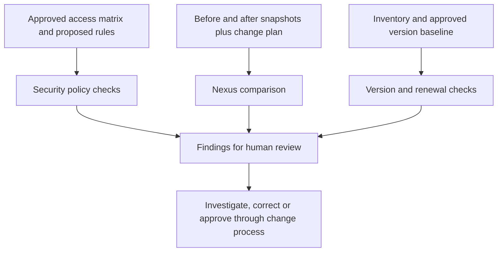

# Network Change Toolkit

Practical examples for reviewing network changes, checking segmentation rules, and preparing device inventory for maintenance and renewals.

**Explore:** [Project map](#project-map) · [Quick start](#quick-start) · [How the tools connect](#how-the-pieces-fit-together) · [Security review](#security-design-and-automation) · [Nexus review](#nexus-change-review) · [Inventory review](#inventory-and-renewal-checks) · [Ansible lab](#ansible-lab-example)

My background includes Cisco campus/core refreshes, firewall and VPN support, and Ansible switch upgrades across eight sites. I put this toolkit together around the questions I would want answered before closing a change: did the expected network state come back, did access stay within the approved design, and what still needs attention?

These are new portfolio demonstrations using fictional data, not code or configurations from former employers.

## What this project demonstrates

- **Change validation:** compare planned work with before/after evidence and keep missing observations visible.
- **Security review:** test ordered access rules against a separate approved-flow matrix and explain each finding.
- **Lifecycle visibility:** surface version drift, stale inventory, missing ownership, and approaching support dates.
- **Operational discipline:** pair automation with runbooks, rollback thinking, explicit limits, and human approval.

## Project map

| Example | What it helps you achieve | Start here |
| --- | --- | --- |
| Security design and access checks | Compare proposed rules against approved flows; flag unexpected access, blocked requirements, missing logging, and shadowed rules | [Read the design](security-design.md) · [View example findings](example-security-report.md) |
| Nexus change review | Compare before/after evidence for two peers and separate expected changes from regressions or missing evidence | [View example report](example-nexus-report.md) · [Open the Python tool](review.py) |
| Inventory and renewals | Find version differences, stale records, missing owners, and approaching support or renewal dates | [View example report](example-inventory-report.md) · [Open sample inventory](inventory-demo.csv) |
| Ansible maintenance collection | Collect read-only IOS version, inventory, and interface information in an authorized lab | [Open the playbook](ios-maintenance-checks.yml) · [Read the upgrade runbook](upgrade-runbook.md) |

The Python examples run locally without hardware, credentials, or external packages. The Ansible example requires a lab and has not been executed against a switch.

## Quick start

Use Python 3.10 or later. Download or clone this repository and open a terminal in its folder. On Windows, use `py` instead of `python` if needed.

### 1. Review a security policy

```sh
python security_review.py security-design.json security-policy-good.json
python security_review.py security-design.json security-policy-drift.json
```

The first passes within the supplied model. The second intentionally introduces a broad, unlogged rule and removes required cloud access, producing findings for review.

### 2. Compare Nexus maintenance evidence

```sh
python review.py before.json after-healthy.json --plan plan.json
python review.py before.json after-regression.json --plan plan.json
python review.py before.json after-partial.json --plan plan.json
```

These demonstrate a healthy planned change, a regression, and incomplete evidence. The last two deliberately return nonzero exit codes.

### 3. Review inventory and renewal dates

```sh
python inventory_report.py inventory-demo.csv --as-of 2026-09-23
```

The fixed date makes the fictional example repeatable. Use the appropriate review date for your own records.

### 4. Run the tests

```sh
python -m unittest discover -v
```

All **34 tests in this repository passed locally** during validation. They cover Nexus change review, inventory checks, and security-policy review. This is local test evidence, not a CI or hardware-validation claim.

## How the pieces fit together



These are separate tools with explicit inputs. The Ansible playbook does not automatically feed the Nexus or security models.

## Security design and automation

The [case study](security-design.md) uses a fictional camera/edge deployment to show segmentation, restricted management access, required application flows, logging, and recovery decisions. It connects selected Cisco security-design objectives to repeatable checks.

`security_review.py` evaluates ordered, first-match rules against an independently supplied approved access matrix. Unmatched flows are denied. It checks every combination of the named zones and services and reports:

- **UNAPPROVED:** access permitted outside the matrix.
- **BLOCKED:** a required flow is denied.
- **NO LOGGING:** a permitted flow matches a rule with logging disabled.
- **UNREACHED:** a rule is never reached within the model; review ordering or shadowing.

The model uses abstract service names, not real IP ranges, port definitions, NAT, identity, or vendor firewall semantics. It does not verify live enforcement or certify compliance. See the case study for assumptions, tradeoffs, and the full access matrix.

## Nexus change review

The JSON snapshots describe two peers, model/version, vPC peer-link/keepalive/consistency, interfaces, port channels, VLANs, and routing neighbors. Observations are manually normalized; this is not a raw NX-OS output parser.

Only exact transitions recorded in `plan.json` are accepted as planned. Missing observations remain incomplete, and vPC health cannot be waived. Existing down states still need review. An empty collection means no objects were captured in scope, so the operator must confirm that scope.

`DEMO-OLD` and `DEMO-TARGET` are fictional version labels. A PASS does not establish image compatibility, image integrity, working traffic, or authorization to upgrade.

To save Nexus results, add `--json report.json --markdown report.md`. These paths overwrite existing files; choose output names deliberately.

## Inventory and renewal checks

Use the supplied CSV headers. Dates use `YYYY-MM-DD`; blanks mean unknown. The tool compares version strings with the supplied approved baseline, flags records older than 30 days, and checks support/renewal dates within `--horizon` days (90 by default).

The report helps identify records needing attention. It does not discover devices, check CVEs, choose firmware, validate license entitlement, or establish regulatory compliance. Owners must provide approved baselines and contract dates; perpetual licenses and missing dates require interpretation.

## Ansible lab example

The [IOS playbook](ios-maintenance-checks.yml) collects version, inventory, and interface status one device at a time. It does not copy firmware, change boot settings, or reload equipment. The [upgrade runbook](upgrade-runbook.md) covers the separate planning, recovery, and validation steps.

Use a Linux/WSL Ansible control environment, the collections in `collections.yml`, and an SSH backend supported by `network_cli`. Review the [official IOS platform guide](https://docs.ansible.com/projects/ansible/latest/network/user_guide/platform_ios.html) and [ios_command documentation](https://docs.ansible.com/projects/ansible/latest/collections/cisco/ios/ios_command_module.html).

```sh
ansible-galaxy collection install -r collections.yml
ansible-playbook -i inventory.example.yml ios-maintenance-checks.yml --syntax-check
# Replace the documentation address with an authorized IOS lab target first:
ansible-playbook -i inventory.example.yml ios-maintenance-checks.yml --ask-pass -e lab_authorized=true -e collection_phase=before
```

This example is for IOS Catalyst switches, not NX-OS. It preserves SSH host-key checking. Collection versions are not pinned because no specific control-node/device combination has been validated. The playbook has been reviewed, but has not been syntax-tested with Ansible or run against hardware. Keep collected device output private and never commit credentials or real inventory.

## Exit codes

| Tool | 0 | 1 | 2 | 3 |
| --- | --- | --- | --- | --- |
| Security review | PASS within model | Review required | Invalid input or file error | — |
| Nexus review | PASS | FAIL | INCOMPLETE | Input/output error |
| Inventory review | Report produced | — | Invalid input | — |

An inventory exit code of 0 means the report was produced, not that every asset met the baseline.

## Related project

[Network Support Triage](https://github.com/malislam/network-support-triage) covers incident evidence, troubleshooting runbooks, customer updates, and engineering handoffs using fictional support bundles.

## Author

[Mohammed Alislam](https://github.com/malislam) · CCNP Enterprise · [LinkedIn](https://linkedin.com/in/malislam/)
