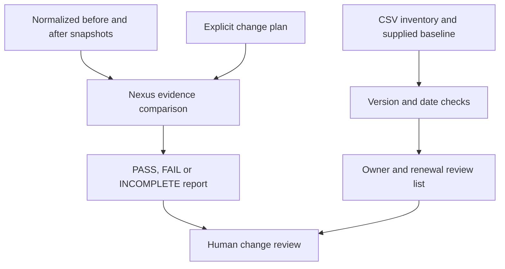

# Network change toolkit

Small tools for reviewing switch maintenance evidence and finding inventory records that need attention before patching or renewals.

My background includes Cisco campus/core refresh work and Ansible switch upgrades across eight sites. This repository is a **new demonstration**, not the original automation or data from those environments. All devices, versions, dates, and plans in the samples are fictional.

## Security design + automation

[Start with the security design case study](security-design.md): a fictional camera/edge network, an approved access matrix, and a Python check that detects policy drift, missing access, missing logging, and shadowed rules.

## Start here

| Example | Purpose | Run without hardware? |
| --- | --- | --- |
| [Nexus report](example-nexus-report.md) | Compare two peers before and after a planned change | Yes |
| [Inventory report](example-inventory-report.md) | Flag version differences, old records, missing owners and approaching dates | Yes |
| [Ansible maintenance checks](ios-maintenance-checks.yml) | Collect read-only IOS evidence before/after maintenance | Requires an authorized lab |
| [Upgrade runbook](upgrade-runbook.md) | Plan compatibility, recovery, execution and validation | Document only |

## Run the offline examples

Use Python 3.10+; no external Python packages are required. Download the repository and open a terminal in its folder. On Windows, `py` can be used in place of `python`.

```sh
python review.py before.json after-healthy.json --plan plan.json
python review.py before.json after-regression.json --plan plan.json
python review.py before.json after-partial.json --plan plan.json
python inventory_report.py inventory-demo.csv --as-of 2026-09-23
python -m unittest discover -v
```

The second and third commands deliberately return nonzero results. Nexus exit codes: `0` PASS, `1` FAIL, `2` INCOMPLETE, `3` input/output error. Use `--json report.json --markdown report.md` to save a Nexus report; these paths overwrite existing files, so choose new output names. Inventory exit `0` means a report was produced, not that all assets met the baseline; invalid input returns `2`.

## Architecture



### Nexus evidence model

The JSON samples document the input shape: two named devices, model/version, vPC peer-link/keepalive/consistency, interfaces, port channels, VLANs and neighbors. States are manually normalized to `up`, `down`, `suspended`, or `unknown`; this is **not a raw NX-OS parser**. vPC fields use the healthy values shown in the examples. `DEMO-OLD` and `DEMO-TARGET` are labels, not recommended releases.

Only an exact transition recorded in `plan.json` is accepted as planned. Missing observations stay incomplete; vPC health cannot be waived. Existing down states require review too. An explicitly empty collection means no objects were captured in scope, so the operator must verify that scope. PASS cannot prove traffic health, hardware compatibility, image integrity or permission to upgrade.

### Inventory and renewal model

Use the CSV headers exactly as supplied. Dates are `YYYY-MM-DD`; blanks mean unknown. The script compares version strings for exact equality with the **supplied** approved baseline, flags records older than 30 days, and checks support/renewal dates against a configurable `--horizon` (default 90 days).

It does not discover devices, check CVEs, determine which release is newest, validate licenses, or certify compliance. Baselines, contract dates and asset ownership must come from approved records. Perpetual licensing and unsupported date fields need human interpretation; a blank is never treated as a valid entitlement.

### Ansible lab example

Use a Linux/WSL Ansible control environment with the collections in `collections.yml` and the SSH backend required by `network_cli`. Review the [official IOS platform guide](https://docs.ansible.com/projects/ansible/latest/network/user_guide/platform_ios.html) and [ios_command documentation](https://docs.ansible.com/projects/ansible/latest/collections/cisco/ios/ios_command_module.html). Collection versions are not pinned because no specific device/control-node combination has been lab-tested here.

```sh
ansible-galaxy collection install -r collections.yml
ansible-playbook -i inventory.example.yml ios-maintenance-checks.yml --syntax-check
# After replacing the documentation address with an authorized lab target:
ansible-playbook -i inventory.example.yml ios-maintenance-checks.yml --ask-pass -e lab_authorized=true -e collection_phase=before
```

The playbook collects version, inventory and port state one device at a time. It does not copy firmware, change boot settings, reload equipment, or bypass SSH host-key checks. It is for IOS Catalyst lab switches; do not run it on NX-OS as-is. Raw IOS output is not automatically converted into the separate Nexus schema.

**Validation:** the offline Python examples and unit tests are exercised locally. The Ansible playbook has been reviewed only; it has not been syntax-tested with Ansible or executed against a switch. Treat it as a lab starting point. Store actual collected output privately and use approved authentication; never commit credentials or real inventory.

## Author

[Mohammed Alislam](https://github.com/malislam) · CCNP Enterprise · [LinkedIn](https://linkedin.com/in/malislam/)
