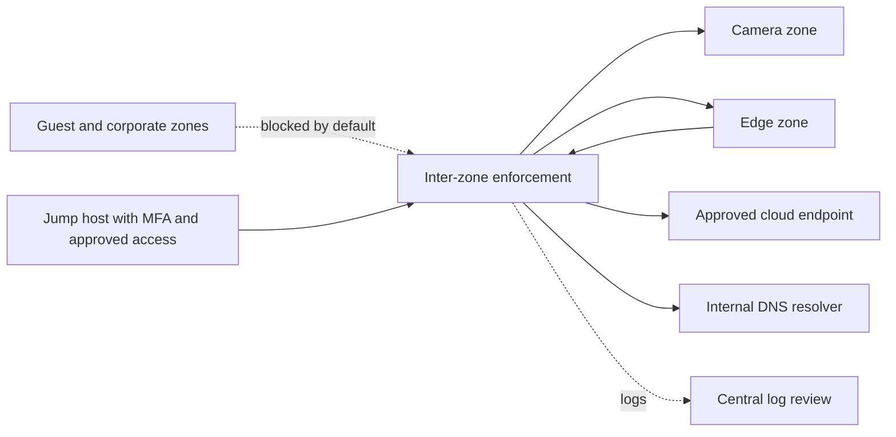

# Security design with automated access checks

## What this demonstrates

Turn a business requirement into a network access matrix, then check a proposed policy against it before making a change. This is a new, fictional portfolio exercise informed by my network operations background and Cisco security-design training. It is not a Voxel deployment guide, employer configuration, or claim of production camera-platform experience.

**Outcome:** a reviewer can see which required flows are blocked, which unexpected flows become permitted, which permitted flows lack logging, and which rules are never reached in the model. The intentionally broken policy demonstrates why a temporary broad rule can create exposure and hide a more specific rule.

## Scenario and boundaries

A fictional warehouse adds cameras and an edge processing device. Keep camera traffic separate from staff and guest networks, permit only documented application paths, and make administrative access attributable. The edge platform is treated as an untrusted workload that could be compromised. A VLAN alone is not an enforcement boundary: inter-zone traffic must traverse a firewall or equivalent enforced policy.



Arrows show conceptual paths, not a full allowed-traffic matrix. The approved matrix below is authoritative for this exercise. Physical wiring, routing, IP addresses, port numbers, identity, and live enforcement are outside the checker.

## Approved access matrix

| Initiator | Destination | Named service | Reason |
| --- | --- | --- | --- |
| Edge | Cameras | video-tcp | Collect camera stream |
| Edge | Approved cloud endpoint | https | Application upload |
| Jump host | Edge | ssh | Authorized maintenance |
| Jump host | Cameras | https | Camera administration |
| Edge | Internal resolver | dns | Name resolution |
| Cameras | Internal resolver | dns | Name resolution |

All other new flows, including guest/corporate access and direct camera-to-cloud access, are denied by default. Service names are abstract labels. In a real design, map them to vendor-validated protocols, ports and destination objects; verify encryption rather than assuming the label proves it. This exercise deliberately omits NTP, updates, monitoring and other dependencies until requirements are established. It is not deployable as written.

## Design decisions and tradeoffs

- **Limit lateral movement:** separate cameras, edge, corporate, guest and management. No broad inter-zone exceptions. Same-zone isolation needs port/host controls and is not proven here.
- **Protect management:** use a hardened jump host, MFA, named accounts and time-bounded authorization. Avoid Internet-exposed management. The checker can review modeled paths, not verify identity controls.
- **Constrain outbound traffic:** define the approved application endpoint rather than granting general Internet HTTPS access. IP/FQDN changes and DNS dependencies require operational ownership.
- **Detect changes:** log permitted flows in this demo, centralize relevant firewall events, and alert on unexpected denied attempts or new access. Actual logging volume, privacy, retention and deny-event sampling need a separate operational decision.
- **Recover safely:** preserve the approved policy and evidence, validate required connectivity in a maintenance window, and roll back if validation fails. Do not deploy an any-any rule to bypass troubleshooting.

## Run the checks

Python 3.10+, standard library only, no hardware or credentials:

```sh
python security_review.py security-design.json security-policy-good.json
python security_review.py security-design.json security-policy-drift.json
python -m unittest discover -v
```

The first returns 0 (PASS within the supplied model). The second deliberately returns 1 (review required). Invalid input returns 2. [Example drift report](example-security-report.md).

The policy uses ordered, first-match rules with an implicit deny. `*` matches all named values in that field. The checker exhaustively evaluates the finite combination of named zones and services against the separately supplied approved matrix. A matching rule applies only to the modeled initiated direction; stateful return traffic is not modeled. Unreached means shadowed within this finite model, not necessarily within a vendor configuration.

Do not generate the approved matrix from the same policy being checked: that would hide drift. Have an owner review the design independently. PASS is not proof that the design itself is correct, that traffic works, or that security/compliance requirements are met. No NAT, routing, IP ranges, IPv6, application identification, dynamic objects or vendor rule semantics are parsed. No real devices are contacted or changed.

## Review workflow

1. Confirm business flows and owner approval; document any exception and expiry outside this demo.
2. Translate a proposed rule set into the explicit model; retain the original configuration for human review.
3. Run checks and review findings alongside device-specific validation.
4. For an authorized lab or production change, separately validate routing, ports, certificates, failover and actual allow/deny behavior.
5. Keep sanitized before/after evidence and a rollback plan; feed recurring incidents back into the design.

## Connection to Cisco security-design objectives

This exercise applies security architecture and design principles, management-plane protection, incident-driven adjustments, and secure automated review. It covers a subset of the [Cisco SDSI objectives](https://www.cisco.com/site/us/en/learn/training-certifications/training/courses/sdsi.html), not the complete course or certification. Automated checks assist human review; they do not deploy changes or grant access.
